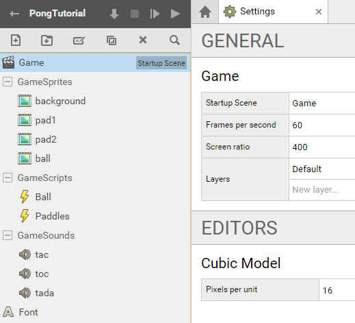
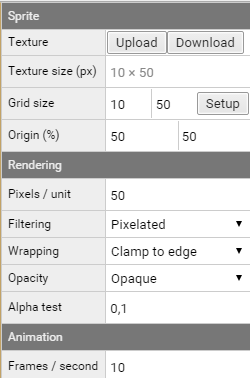
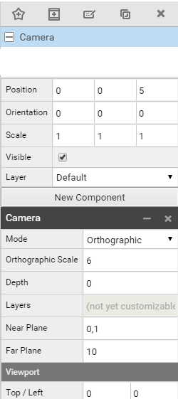

# SUPERPOWERS TUTORIAL #1 SUPER PONG
## *Chapter 2 : Preparing Superpowers*

### Building the project structure

*I consider you already have Superpowers installed and working and we jump directly to the game.
If you want to learn the basics of the application please check the [official documentation][1].*

We start our server and we create our **new project** than we call PongTutorial.

We start by creating a **Scene** (new asset or ctrl+n) called **Game**.

In **settings**, we put Game in the **Startup Scene**. (drag and drop or write Game)
A gray label should appear. And we set the **Screen ratio** to (400, 300)

We create a hierarchy structure for our assets, we will put sprites files inside
GameSprites, sounds in GameSounds and Scripts in GameScripts.

We create new assets, 4 Sprites, 3 Sounds and 2 Scripts, we add also a Font asset:

*Note : The order of your assets and folders have no incidence.*

* Game
* GameSprites
    * background
    * pad1
    * pad2
    * ball
* GameScripts
    * Ball
    * Paddles
* GameSounds
    * Tac
    * Toc
    * Tada
* Font

###  Loading the game assets

*An asset is a box holding an element of the game, it can be an image, a script, a sound, etc.*

We have built the game assets structure but they will stay empty if we don't give
them contents (which is files for sprites and sounds and code for scripts).

First you will need to download the source assets on [the repository github here][2].

The sprites and sound assets need to be uploaded inside the project.
For each asset, we load the file related. (Example, background.png in asset backgound)

The sprites assets need calibration with a **setup**, the **grid size** must be the same size than
the image because we don't use frame for this game.
We just accept the default frames/row and frames/column which is 1 for both.

We change the rendering **Pixels / Unit** of each Sprite assets which is by default 100, to 50.

We don't need to change the **origin** of our sprites. The default % (50, 50) which is
origin to the center is good for all of our sprites for this game.

Here the example of pad2 with the correct set up.

In the Font Asset, we change the **Pixels / Unit** to 100 and the **Size** to 64.

After loading the sound file to the Sound assets, everything fine, you can just test each sound.

We are now fine with the assets, we can start to build our game scene.

### Building the scene

*The Scene is the screen where all objects (called actors) are connected together.*

We will now set all the objects of the scene. We call an object inside the scene, an Actor.

To see the others Actors inside the game, we first need a Camera Actor.

*Note : We can switch the camera mode 2D / 3D to navigate inside the scene, see documentation.*

We create a **new actor** than we name **Camera**.

We set the **position** on axis Z (the third) to 5 to place the camera to the front of all
others objects who have a position on axis Z less than 5 :

We add a **new component** Camera.

And we change the mode to **Orthographic**.

We then set the **Orthographic Scale** at 6. (We do this to fit with the background)

We create All the Actors objects of our game following this organization of actors :

We add a **new component Sprite Renderer** in Background Actor and drag and drop the Sprite
background in Sprite. (or write the path GameSprites/background)

We do this step again for the Actors Ball, and the two Paddles of Player1 and Player2.
For each of them we create a new component Sprite Renderer and we connect the Sprite
Path of the correct Sprite. Pad1 for the Paddle of Player1, etc.

We create a new component **Text Renderer** for each of the Score Actors and we drag
and drop the Font in the Font area. We write 0 to the Text area.

*Note : When the project become bigger, there is the possibility to duplicate Actors
to avoid repetition, but like we are learning, repetition of this step is important.*

We have everything inside the scene now.

We need to set correctly all the **positions** of the Actors, to be able to see them
nicely when we launch the game.

We have already set the Position of the Actor Camera to (0, 0, 5), here the position
of all the others Actors :

* Background (0, 0, 0)
* Ball (0, 0, 4)
* Player1 (0, 0, 0)
    * Paddle (-3.7, 0, 4)
    * Score (-2, 2.5, 2)
* Player2 (0, 0, 0)
    * Paddle (3.7, 0, 4)
    * Score (2, 2.5, 2)

To finish we can change the color of each Score Actors, you can do so by clicking
on the little checkbox next to the label color and choose color.
Here the hexadecimal colors codes :

* Player 1 – Score : f14735
* Player 2 – Score : 356ef1

Ok, all the Actors are placed, we can launch the game to see if everything display correctly.
Right now, nothing will happen beside the display and it is normal. We need to start
programming the logic of our game to have some interaction. However a last step before to
jump in the code is to set the Physic Bodies to our sprites, we will need this solid bodies
for the collision between the ball and the paddles.

### Setting Arcade Bodies

In our Game Scene, we need to gave new component **Arcade Body 2D** to both of our Paddles and to our Ball.

We then change for both paddles the size of x to 0.2 and keep y to 1 (size = 0.2, 1) and for the ball
the size of x and y to 0.2  (size = 0.2, 0.2) in a way than the bodies do the same size than our sprites.

In the game the illusion is than the sprite ball will collide with the sprite paddle,
in reality, it is the ball physic body and the paddles physic bodies that will collide.
The sprite is just attached to it and follow the movement of the body.

[1]: http://docs.superpowers-html5.com/en/getting-started/about-superpowers
[2]: https://github.com/mseyne/superpowers-sources/tree/master/1SuperPong
