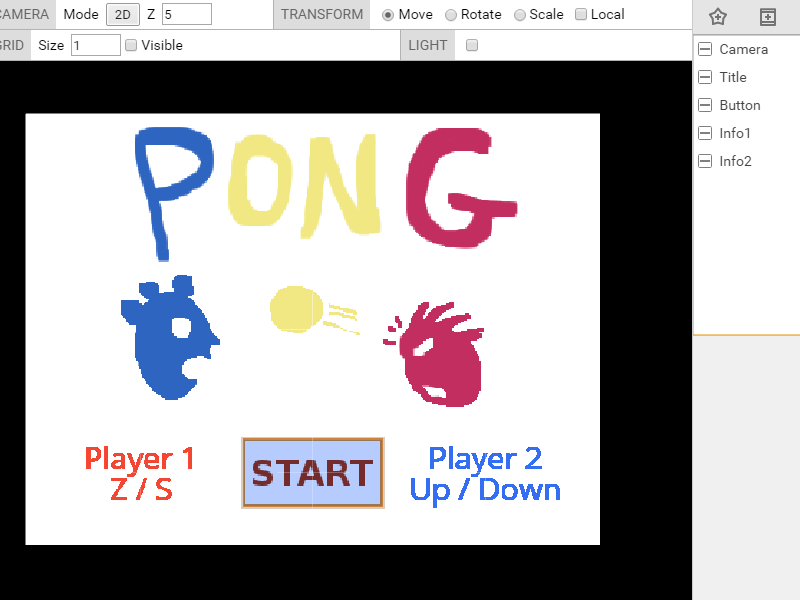

# SUPERPOWERS TUTORIAL #1 SUPER PONG
## *Chapter 4 : polishing the game*


### Build the Menu Structure and load assets files

We are going to build a Menu, it is the place where the player come when the game
is launch for the first time. It is an opportunity for us to build a simple button
in Superpowers and have a glimpse on Mouse control and interaction.

We start by adding assets to the structure of our program, we add one Scene than
we name Menu, We add the sprites and load the image files for each. We also add a
new script, button, than we will use for the code of our Menu.

* Menu (Startup Scene)
* MenuSprites
    * title
    * starton
    * startoff
* MenuScripts
    * button

In Settings, we change the start up screen from Game to Menu, this way the game
will start with the Menu Scene we are building. We have now this structure :


When we load sprites assets we need to do a setup for each to give the grid size
 the same than the image size. It will place the origin to the center and will be
  important to the position of sprite in the scene later.


### Build the Menu Scene

We are going to combine assets together in a way to have this screen when we launch the game :



We start to create an Actor Camera with a new component **Camera**. We also create two
 actors with the component **sprite renderer**, (Title, Button) and two actors with
 the component **text renderer**. (Info1 and Info2).

Here the properties for each actors :

* Camera, position (0, 0, 4), mode = Orthigraphic, Orthographic Scale = 3 (the camera should fit with the image title.png)
* Title, position(0, 0, 0), sprite = MenuSprites/title
* Button, position(0, -1, 2), sprite = MenuSprites/startoff
* Info1, position(-1.2, -1, 0), Text = Player 1 Z / S, color = f14735 , size = 32
* Info2, position(1.2, -1, 0), Text = Player 2 Up / Down, color = f14735 , size = 32

We have now our menu with game instructions. We only need to have a functional button. We start programming it.


### Scripting a Button

We write the variables we will need for our script, the important part of it is
the Math.Ray function than we need to locate the intersection between the mouse and the game screen.

```TypeScript
// We initialize a global variable ray which is of type Math.Ray
var ray : Sup.Math.Ray;

class ButtonBehavior extends Sup.Behavior {
  // flag to tell when the mouse hover the button
  isHover : boolean = false;

  awake() {
    ray = new Sup.Math.Ray(this.actor.getPosition(), new Sup.Math.Vector3(0, 0, -1));
  }
[...]
```

We next define a function mouse inside the class ButtonBehavior. We change the
sprites of an actor by calling the method spriteRendere.setSprite(spritepath) to
 this actor. We load the scene Game when we click the button with Sup.loadScene(SceneName).

```TypeScript
  /* We define different possible actions of the mouse,
  click action load the game scene, hovering and unhovering
  make the button to change the sprite.*/

  mouse(action) {
    if(action == "click"){
      Sup.loadScene("Game");
    }
    else if(action == "hover"){
      Sup.getActor("Button").spriteRenderer.setSprite("MenuSprites/starton");
    }
    else if(action == "unhover"){
      Sup.getActor("Button").spriteRenderer.setSprite("MenuSprites/startoff");
    }
  }
```

And finally in the update loop, we build the logic of our button with checking conditions.
 We update our variable ray at each frame to have the position of the mouse in the screen.
  We check the intersection of the mouse and the button with the method intersectActor.
  For each condition, if the check is true, the function mouse(action) is called.

```TypeScript
  update() {
    // Refresh position of the mouse in the camera
    ray.setFromCamera(Sup.getActor("Camera").camera, Sup.Input.getMousePosition());

    /* Condition to check if yes or no, the mouse hover
    the button, and if yes, check if the mouse click.
    We call the mouse function with the action related. */

    if(ray.intersectActor(this.actor, false).length > 0){
      if(!this.isHover){
        this.mouse("hover");
        this.isHover = true;
      }
      if(Sup.Input.wasMouseButtonJustPressed(0)){
        this.mouse("click")
      }
    }
    else if(this.isHover){
      this.isHover = false;
      this.mouse("unhover")
    }

  }
}
Sup.registerBehavior(ButtonBehavior);
```

Before to start the game, we need to attach our script by adding a new component
 behavior to the actor Button and choose the class ButtonBehavior.

We now have a menu and an almost finished game, we can now give sounds and a possibility to end the game.


### Adding Sound

We already have loaded the assets sounds, we are going to incorporate them inside ou game.

But before to return to the Game scripts, we can add one sound in the menu when
we click to start the game by simply writing one line of code with the method **Audio.playsound**.

```TypeScript
[...]
if(action == "click"){
      Sup.loadScene("Game");
      Sup.Audio.playSound("GameSounds/toc");
    }
[…]
```

We want a sound when the ball touch a side or the paddle, we also want a sound when there is a goal. We then go in the Ball script and add Audio sounds in the conditions of update :

```TypeScript
[…]
if(y > 2.85 || y < -2.85){
      Sup.Audio.playSound("GameSounds/tac");
[…]

[…]
if(Sup.ArcadePhysics2D.collides(this.ball, Sup.ArcadePhysics2D.getAllBodies())){
      Sup.Audio.playSound("GameSounds/toc");
[…]

[…]
    if(x > 4 || x < -4){
      Sup.Audio.playSound("GameSounds/tada");
[…]
```

The game have sounds.

### Adding an end to the game

To polish the game we could create a new scene victory which display the player
who won on the screen. We would need to load this scene when the number of point reach a maximum.
But here, we will just return to the menu screen when one player get 10 points.

We need to add a condition at the end of the loop update.

```TypeScript
[…]
if(this.score[0] == 10 || this.score[1] == 10){
      Sup.loadScene("Menu");
    }
[…]
```

The game is now complete.
