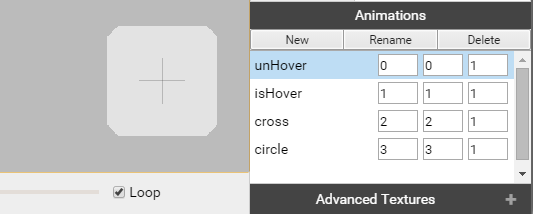
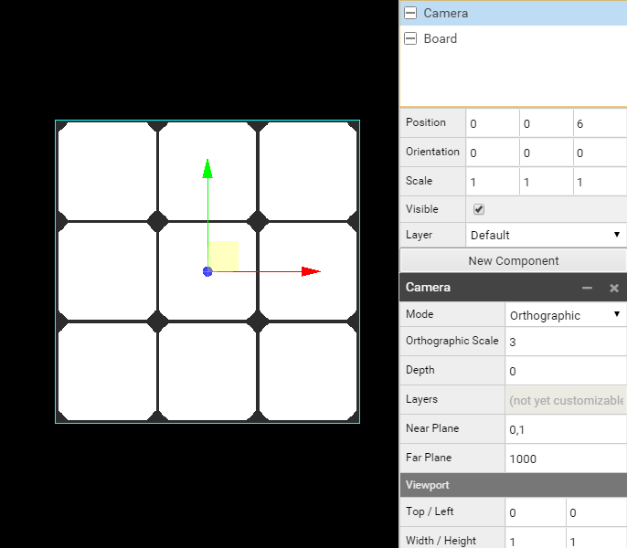
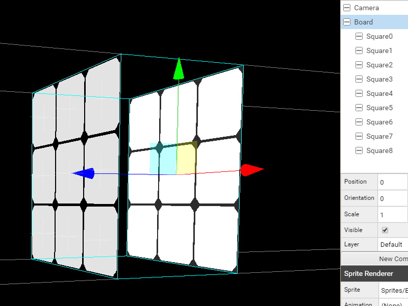

# SUPERPOWERS TUTORIAL #2 SUPER OXO
## *Chapter 2, Building the Game Structure*

Before to write the game logic, we will use Superpowers to prepare everything we will need for our game to display correctly.

After launching our server, we create a new Project for our game.

### Loading game assets

We start to create a new Scene called Game and set it up as the Startup Scene in the Settings.

Also, in the Settings we can give the Screen ratio of our game to 300 for x and 300 for y.

We build the assets structure by creating two folders, one for the Sprites and an other for the Scripts.

We create next the new assets : 3 Sprites and 2 Scripts. Here the structure of our game :

* Game (Startup Scene)
* Sprites
   * Symbols
   * Screens
   * Board
* Scripts
   * Global
   * Player

For each of our sprites asset we upload the img file related (you can find them in
this [source repository](https://github.com/mseyne/superpowers-sources/tree/master/2SuperOXO))
and we set the grid with setup.

For the Symbols and Screens Sprites we create new Animations which will only be frames we
use to select when we need them. For Symbols Sprite we have four differents frames:
unHover, isHover, cross and circle. We use animation with only 1 frame each as we use
this tool to switch from one to an other in the game but we won't use animated sprites as a feature.

We do the same with the Screens Sprite, we have 3 frames, cross, circle and tie.

We have now this configuration for each sprites :

* Symbols, file : symbols.png, size : 96 x 384 , grid : 96 x 96
   * Animations :
      * unHover (0,0,1)
      * isHover (1,1,1)
      * cross (2,2,1)
      * circle (3,3,1)
* Screens, file : screens.png, size : 300 x 900, grid : 300 x 300
   * Animations :
      * cross (0,0,1)
      * circle (1,1,1)
      * tie (2,2,1)
* Board, file : board.png, size : 300 x 300, grid : 300 x 300

### Building the Game Scene

In the Game Scene, we start by creating a new Actor Camera with a new component Camera.

We set the position of Camera to (x = 0, y = 0,  z = 6), all the others actors
will be placed in relation to this origin x = 0 and y = 0 and placed on z before 6.
 (After 6, the Actors are out of the camera focus).

We create a new Actor Board with a new component Sprite Renderer with the Sprite
(path) Sprites/Board. We check the position of Board is to (0, 0, 0).

In the Camera Actor we change the Camera Mode to Orthographic and the Orthographic
Scale to 3. (To fit with the Board Sprite)

We now need to set the 9 Squares Actor of the game and place each of them on the
board grid. This actors will be the one which interact with the game logic.

The Board Actor will be the parent and background and all the Squares Actors will
be to a z position in front of the Board.

We create a first new actor Square4 and check its position to (0, 0, 2) and we give
a new component Sprite Renderer with the Sprite Sprites/Symbols. (The first frame
  unHover is a little grey square that fit right in the board squares)

We duplicate it 8 times (Ctrl + D), changing the names accordingly to have Square0 to Square8.

Note : Because in Array and often in programming, we start to count to 0, we will
approach the squares names the same way starting from Square0, Square1, Square2, etc.

We have now to set the position of each square, starting from Square0 to the up
left and the Square8 to the down right position. Here the correct positions (x, y, z)
for each Square to fit in the board.

* Square0 (-1, 1, 2)
* Square1 (0, 1, 2)
* Square2 (1, 1, 2)
* Square3 (-1, 0, 2)
* Square4 (0, 0, 2)
* Square5 (1, 0, 2)
* Square6 (-1, -1, 2)
* Square7 (0, -1, 2)
* Square8 (1, -1, 2)

We have now a complete Scene.

We can also switch to the 3D mode of the camera and run the game to check if everything is
in place and work fine before to jump in the code.

