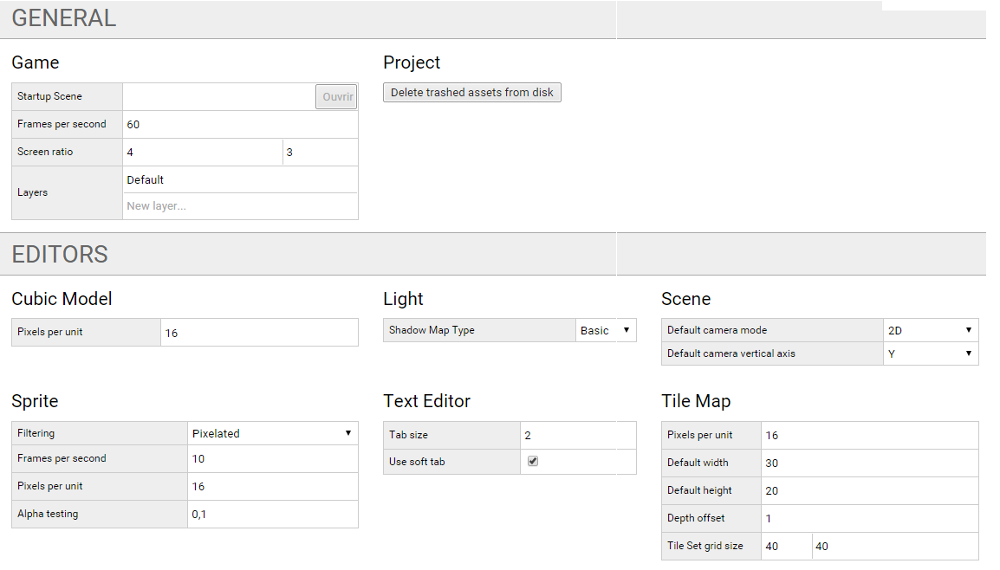
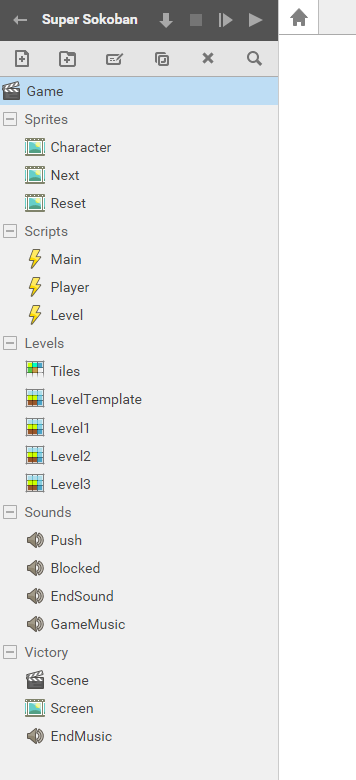
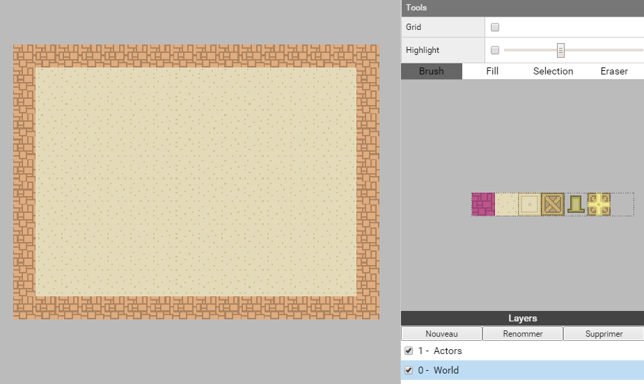
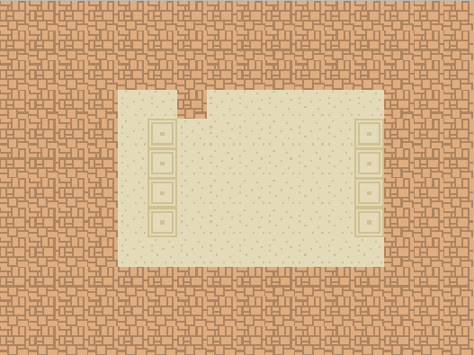
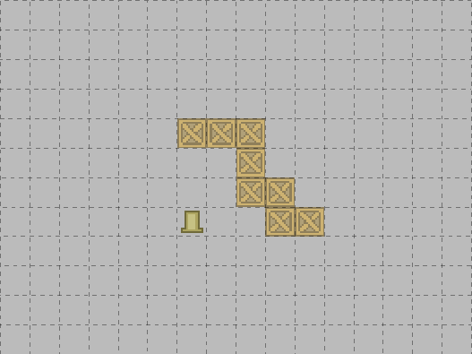
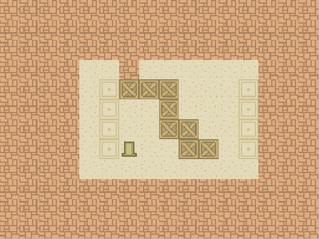
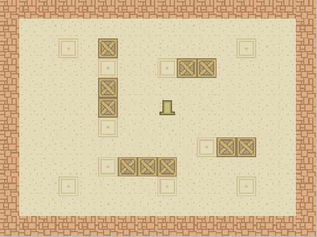
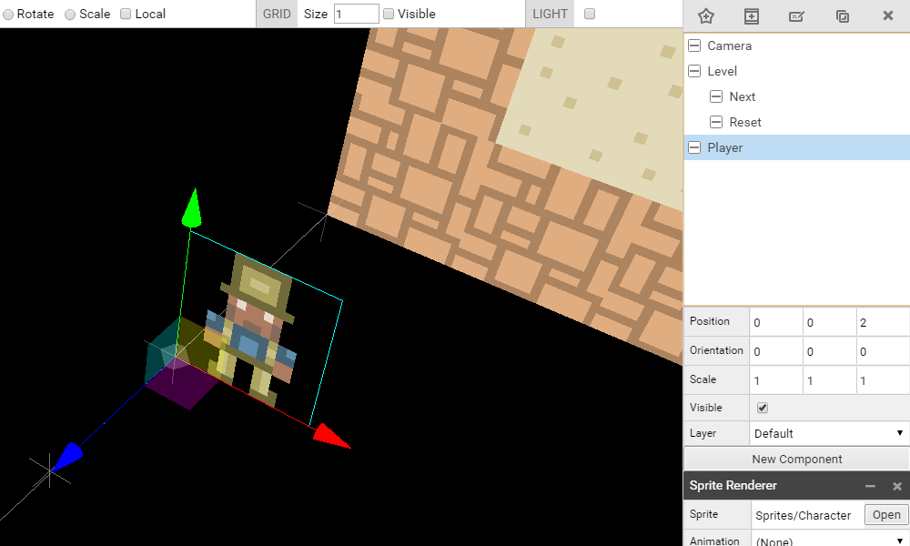

# SUPERPOWERS TUTORIAL #3 : SUPER SOKOBAN
## *Chapter 2 : Shaping the game structure*

### Settings

Like before, we will first use Superpowers to build our game as much as we can
before to start the programming process. This time it is not only about loading
assets and combine them in a Scene which we will use in our code, but also we will
 take advantage of the map editor from Superpowers to build our levels.

First let create a new project and go in the settings. We will choose a standard
**screen ratio** of 4 / 3 for our game. We will use tiles of 16x16 pixels, our screen
size will be something in pixels like (4*16*x in width and 3*16*x in height like
  640 x 480 for example).

We can change the default **camera mode** to 2D, but you will be able to change anytime
you want in the scene.

For **Sprite** and **Tile Map** we change the default **Pixels per Unit** from 100 by default
to 16, which will serve as 1 unit for 16 pixel in the camera screen. This way it
will be easier later in our program to say by example to move our character to one
 unit, which be understood directly as to move to 16 pixels. In fact it will help
  us to have a syncronicity between our 16x16 tiled map and our Camera Screen.

### Loading game assets

We can start to build our structure, we add the **assets** we will need, new scenes,
sprites, tileset, tilemaps, sounds and scripts.

We will proceed step by step as we build the game, however here the complete finale
 asset structure than we can build now (empty assets) if we want.

* Game (Will be our Startup Scene)
* Sprites
  * Character (sprite of the player character)
  * Next (transition sprite)
  * Reset (information sprite)
* Scripts
  * Main (Will contain our main game functions)
  * Player (The player behavior)
  * Level (The level behavior)
*  Levels
  *  Tiles (Tile Set)
  * LevelTemplate (Tile Map)
  * Level1 (Tile Map)
  * Level2 (Tile Map)
  * Level3 (Tile Map)
* Sounds
  * Push
  * Blocked
  * EndSound
  * GameMusic
* Victory //this folder contain the assets we will use to finish the game
  * Scene
  * Screen (Sprite)
  * EndMusic (Sound)

We start to create 3 sprites, Character, Next and Reset and we give to each the
image file (png) with the same name. All should already be 16 pixels per unit,
but we still need to set them individually.

* For the Reset sprite, the **grid** is the same size than the image 160 x 16.
* For the Next sprite, the grid is composed of two frame of 128 x 128.
  * We create an animation called next and we give the start frame 0 and the last frame 1.
  * We also set the **Frames / second** to 2 instead of 10, that will slow down the animation.

* For the character sprite, we need to set the grid to 16x16, the same size than,
like we will se later, the tiles of our game world.
  * We set the origin to the sprite to 0, 0 (down and left)
  * We need to create 4 animations (that won't be much animated, because they all have one frame) :
    * down (frame 0, 0)
    * up (frame 1, 1)
    * right (frame 2, 2)
    * left (frame 3, 3)

### Tiles and level mapping

We will now learn how to build levels that we will use for our game. Before to
start mapping we need a tile set, which is the graphical tile that we will use to draw (map) our level.

In the folder Levels, we create an asset **Tile Set** than we call Tiles.
We then load the image file tiles.png and set the grid to 16x16.

Note that it is important to have our last tile as an empty tile because will
mapping we will use it for transparency between layer and also an eraser Tile.

Each tile have it's own index and we will use them many time in our code. The first
tile start to 0, and the last tile can also be called with the index -1.

Still in the folder Levels, we create now a **Tile Map** that we call LevelTemplate and
that will serve as the main model for all our level than we will duplicate (Ctrl+D) from this one.

* We first attach the tile set Tiles to it (by drag and drop or by writing the path name Levels/Tiles)
* We change the map size to 16 x 12 tiles (wich respect the screen ratio 4  x 3).
* We create 2 layers, World for layer 0, and Actors for layer 1.

*Note than the layer order is important as it is related to which come first in
the camera view, 0 is the farthest of all layers and the other overlaps each other.*

By default, the layers are covered with -1, it is also why the empty and transparent
 tile is important if we want to be able to draw our map on a blank canvas and have
 more than one layer.

Here the way we will draw the map, we have the tiles on the right side, we can
select each one and brush or fill the map. Let's do some tests on our World layer
with the two first tiles, the wall and floor.

We have a simple map, it is generic for our LevelTemplate Tile Map.

First let duplicate LevelTemplate and call our new Tile Map Level1, then we can
draw what we want.

We also add target tile in the World layer, (tile index 2).

Here the layer World for our Level 1 we will use for our game.

For each of our maps we also need boxes and the player start position. We put as
 much boxes as there is target. The boxes and the player start position (index 3
    and 4) have to be on the layer Actors.

Here the layer Actor for our Level1 and both layers together.

And here also the complete maps for our Level2 and Level3, the puzzles are simple
and for now this choice will be useful to do test on the game mechanic as we program
the logic, it will be easy later to remplace them by more challenging puzzles.

### Building the game Scene

We start by creating a new Actor called Level to which we attach a new component
Tile Map Renderer.

* We attach to this actor our Tile Map LevelTemplate (drag and drop or path).
* We check the Level actor is in position 0, 0, 0.

We then create a new Actor called Camera to which we attach a new component Camera
and we switch the mode to Orthographic with an **Orthographic Scale** of 12.

* To have the camera fitting the center of the level, we need to have a position to (8, 6, 6).

We add now a new actor called Player to which we attach a new component Sprite Renderer.

* We attach to this actor our Sprite Character (drag and drop or path).
* We check the Player actor is in position 0, 0, 2. (2 because we want it to appear
  in front of our level)

We set our Game scene in the settings as the **Startup Scene**.

We can launch the game to check if everything display correctly.

We add also, as childs of the Level actor, two new actors, Reset and Next, to
which we attache new Component Sprite Renderer with the sprites of the same name.

Reset actor position (8, 0.5, 4)
Next actor position (8, 6, 4)

For the Next actor, we set the default animation to next.

We also switch off both of them the visible parameter, because we won't use them
in the beginning of our development.

All right, we now have our complete game structure in place. We can now start programming.
